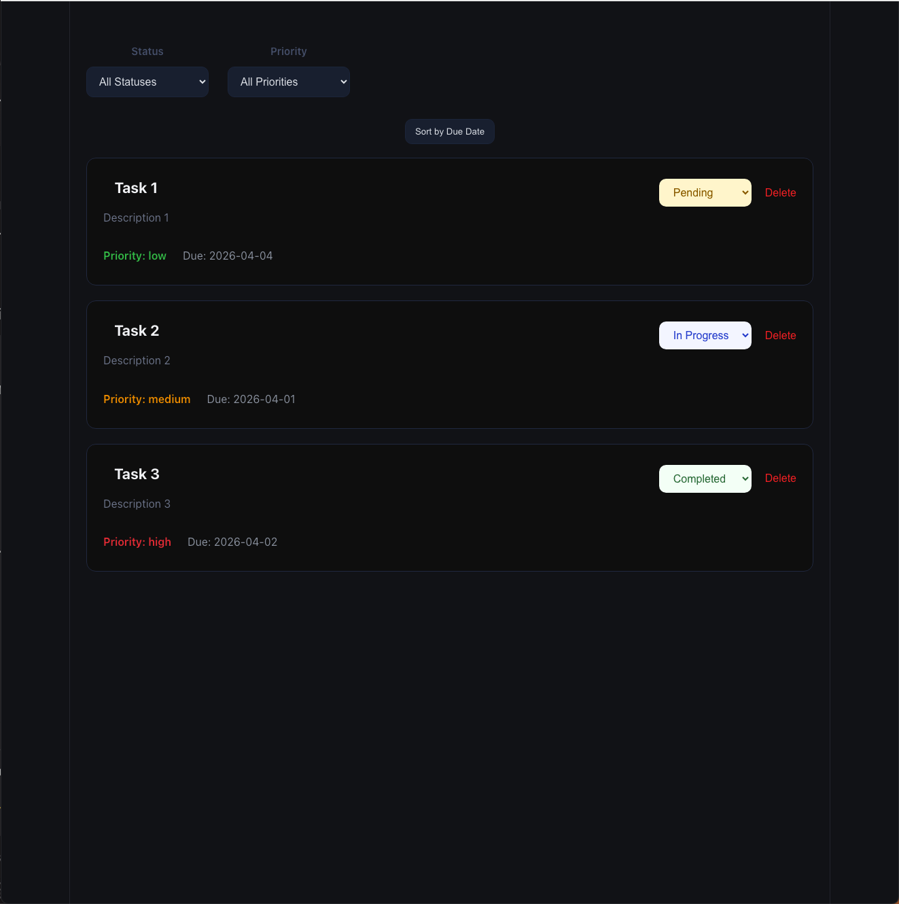
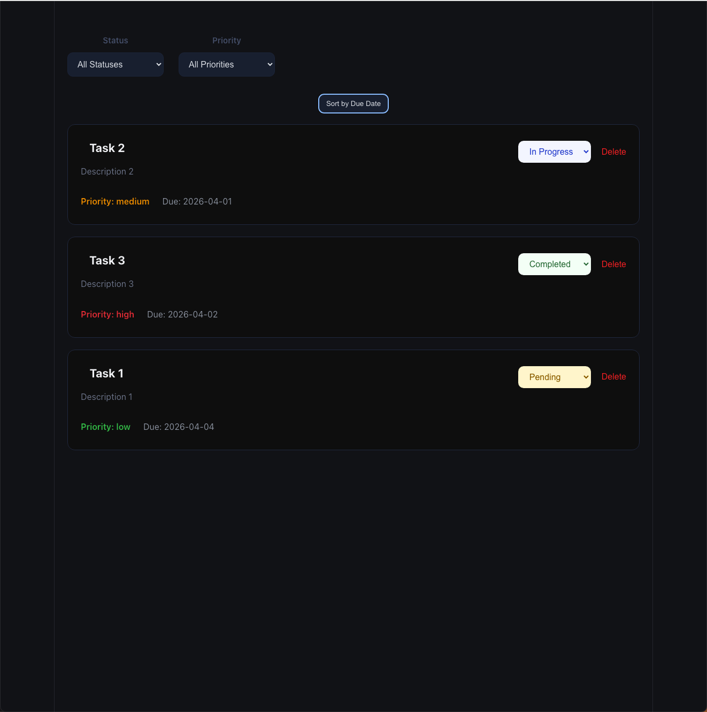

# Lab 3 Task Manager

A small task management interface built with React, TypeScript, and Vite. The app renders a task list, supports filtering by status and priority, allows task status updates, allows task deletion, and includes an optional sort button for ordering tasks by due date.

## Features

- Render tasks with unique `id` keys
- Filter tasks by status
- Filter tasks by priority
- Combine both filters at the same time
- Update a task's status from a dropdown
- Delete a task
- Sort tasks by due date
- Apply conditional styling for status and priority

## Components

### `App`

`App` is the parent container. It owns the main task state and filter state, computes `filteredTasks`, and passes data and callback props to child components.

### `TaskFilter`

`TaskFilter` renders dropdowns for:

- status
- priority

It sends the current filter selection back to `App` through `onFilterChange`.

### `TaskList`

`TaskList` renders the sort button and the list of task items. It also shows an empty-state message when no tasks match the current filters.

### `TaskItem`

`TaskItem` renders a single task and provides:

- a status dropdown for updating task status
- a delete button
- conditional styling for status and priority

## Example Usage

The app starts with three sample tasks in `App.tsx`:

```ts
[
  {
    id: "1",
    title: "Task 1",
    description: "Description 1",
    status: "pending",
    priority: "low",
    dueDate: "2026-04-04",
  },
  {
    id: "2",
    title: "Task 2",
    description: "Description 2",
    status: "in-progress",
    priority: "medium",
    dueDate: "2026-04-01",
  },
  {
    id: "3",
    title: "Task 3",
    description: "Description 3",
    status: "completed",
    priority: "high",
    dueDate: "2026-04-02",
  },
]
```

Example interactions:

1. Choose `Completed` in the status filter to show only completed tasks.
2. Choose `High` in the priority filter to show only high-priority tasks.
3. Combine `Completed` and `High` to narrow the list further.
4. Change a task's status from the dropdown in `TaskItem`.
5. Click `Delete` to remove a task.
6. Click `Sort by Due Date` to reorder tasks from earliest due date to latest due date.

## Output Screenshots

### Before Sorting



### After Sorting



## How To Run

1. Install dependencies:

```bash
npm install
```

2. Start the development server:

```bash
npm run dev
```

3. Open the local URL shown in the terminal, usually:

```bash
http://localhost:5173
```

## Project Structure

```text
src/
  components/
    TaskFilter/
    TaskItem/
    TaskList/
  types/
  App.tsx
```

## Notes

- Task data is currently stored in component state in `App.tsx`.
- Due dates are stored as strings in `YYYY-MM-DD` format for simple sorting and display.
- Filtering is implemented by deriving `filteredTasks` from `tasks` and `filters`.

## External Resources

This project was built as a course lab using React, TypeScript, and Vite. No external tutorial code was copied into the project.
